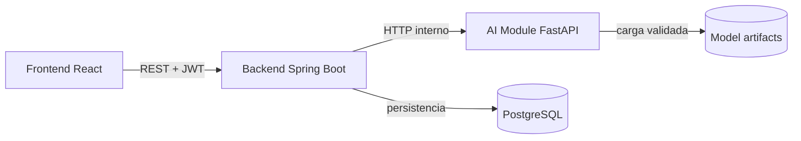

# Arquitectura actual

## Overview

PFI RM Lumbar es un prototipo académico de apoyo técnico para el análisis de resonancias magnéticas lumbares. La aplicación separa la interfaz, la API de producto, el procesamiento de imágenes y la persistencia. Toda salida es revisable, no constituye diagnóstico y conserva la necesidad de revisión profesional.

La arquitectura actual mantiene un flujo simple:

```text
Controller → Service → Repository o Client
```

No se aplican capas adicionales, ports/adapters ni factories sin una necesidad concreta.



El frontend no se comunica directamente con el AI Module. El backend es la frontera/API del sistema y evita exponer rutas internas, detalles de infraestructura o artifacts no publicables.

## Components

### Frontend

Aplicación React/Vite que presenta la worklist, carga estudios, muestra evidencia y mediciones, coordina la navegación por planos y registra la decisión profesional. Configura la URL pública del backend en build con `VITE_API_BASE_URL` o, dentro de la imagen Docker, en runtime con `BACKEND_URL`.

No conoce la URL interna del AI Module ni descarga assets directamente desde él.

### Backend

Aplicación Spring Boot sobre Java 17. Sus responsabilidades actuales son:

- autenticación JWT, estados de cuenta y autorización por roles;
- API REST y contrato OpenAPI;
- validación y normalización de requests/responses;
- coordinación del AI Module mediante clientes HTTP;
- persistencia de estudios, corridas, artifacts, revisiones y auditoría;
- proxy seguro y, cuando corresponde, almacenamiento durable de assets;
- sanitización de errores, trace IDs y headers de seguridad.

Los packages principales reflejan responsabilidades concretas:

- `auth`: autenticación, cuentas, roles y sus excepciones;
- `controller`: endpoints agrupados por capacidad;
- `service`: casos de uso y coordinación;
- `repository`: persistencia en memoria o PostgreSQL;
- `client`: integración con el AI Module y errores de integración;
- `dto` y `domain`: contratos de transporte y modelos internos;
- `config`: properties y wiring;
- `web.error` y `web.filter`: manejo HTTP transversal;
- `util`: utilidades sin pertenencia a una capa HTTP o de negocio.

### AI Module

Servicio Python/FastAPI que registra inputs, valida estudios, ejecuta preprocessing, inferencia y postprocessing, calcula mediciones geométricas, genera evidencia/assets y devuelve resultados estructurados. No gestiona usuarios, permisos de producto ni persistencia clínica.

El backend consume actualmente el contrato multiplanar interno configurado como `v1` o `v2`; el contrato público que ve el frontend permanece normalizado por el backend.

### PostgreSQL

Persistencia operativa de los modos Compose y producción. Guarda cuentas, estudios de-identificados, corridas, metadata de modelos, revisiones, correcciones, auditoría y snapshots de assets permitidos.

La implementación en memoria existe para desarrollo aislado y tests. Producción exige `PFI_PERSISTENCE_MODE=postgres` y falla al iniciar si se configura persistencia efímera.

### Model artifacts

Los modelos sagital y axial de segmentación, junto con sus manifests/model cards, participan en la imagen publicada del AI Module. El runtime verifica identidad y metadata antes de considerar una corrida estricta como real.

Los clasificadores subarticular y degenerativo multitarea usan checkpoints externos que no se redistribuyen. Si no se configuran, el servicio sigue disponible y reporta esas capacidades como `not_configured`; sólo los endpoints dependientes responden indisponibilidad.

## Flujo principal

1. El usuario se autentica contra el backend.
2. El frontend envía un archivo por plano o un ZIP DICOM de-identificado.
3. El backend valida tamaño y parámetros y delega la ingesta al AI Module.
4. El AI Module devuelve `inputId` opacos; no devuelve al navegador paths del filesystem.
5. El backend solicita una corrida de un plano o multiplanar.
6. El AI Module devuelve el resultado técnico y los identificadores de assets.
7. El backend valida el contrato, normaliza la presentación y persiste la corrida cuando corresponde.
8. El frontend consulta el resultado y los assets siempre a través del backend.
9. Un profesional registra la revisión y las correcciones.

El recorrido ejecutable está en [api-examples.md](api-examples.md).

## Assets

Los assets públicos permitidos son imágenes como `input.png`, `overlay.png` y `mask-preview.png`. El backend valida `runId`, plano y nombre antes de servirlos. Artifacts internos como `mask.npy` y `confidence.npy` no son publicables.

El navegador recibe assets mediante `/api/ai/assets/{runId}/{plane}/{assetName}` porque así:

- se aplica la misma autenticación y autorización que al resto de la API;
- no se expone la topología ni el filesystem del AI Module;
- se controla el conjunto de nombres y content types permitidos;
- PostgreSQL puede servir un snapshot durable aunque el artifact upstream ya no esté disponible;
- se preservan trazabilidad, caching privado y sanitización de errores.

Los objetos DICOM SEG y SR se solicitan también al backend, que valida los identificadores y fuerza headers de descarga seguros.

## Inferencia

El pipeline conceptual es:

```text
Input → validación → preprocessing → modelo → postprocessing
      → mediciones geométricas → resultado estructurado → revisión humana
```

El sistema distingue el modo solicitado del modo efectivo. Fuera de una request estricta puede devolver un contrato degradado para mantener disponible la interfaz. Por eso HTTP 200 no demuestra por sí solo que un modelo se ejecutó:

- en `pipeline/run` deben revisarse `degradedMode` y `aiModuleAvailable`;
- en `multiplanar/run` debe revisarse `effectiveInferenceMode` en la raíz y por plano, además de `degradedMode`.

Una request `real_baseline` con `allowContractFallback=false` es estricta: una salida degradada o incompatible se rechaza como error y no se persiste como corrida completada.

## Seguridad y revisión humana

- JWT Bearer protege la API salvo endpoints públicos de autenticación, liveness y OpenAPI habilitado.
- Los roles efectivos son `ADMIN`, `DOCTOR`, `REVIEWER` y `PENDING_APPROVAL`.
- Una cuenta pendiente puede autenticarse, pero no ejecutar operaciones profesionales hasta ser aprobada.
- Las operaciones administrativas verifican `ADMIN`; las operaciones clínicas aceptan roles profesionales activos.
- Los resultados mantienen `humanReviewRequired=true` y `notClinicalDiagnosis=true` cuando corresponde.
- La revisión canónica se persiste con estado, profesional, comentarios y correcciones; también genera auditoría.

## Deployment

### Development

`compose.local.yml` construye backend, AI Module y frontend desde los tres repositorios hermanos y levanta PostgreSQL. Es el modo para desarrollar y probar cambios de source.

```bash
docker compose --env-file .env -f compose.local.yml up --build
```

### Registry

`compose.yml` usa imágenes publicadas en GHCR. Sólo requiere ese archivo y una copia de `.env.registry.example` como `.env`.

```bash
docker compose pull
docker compose up -d
```

`latest` sigue a `main`; los tags `sha-<commit>` permiten fijar una versión reproducible.

## Documentación y evidencia

- Operación actual: este documento, el [README](../README.md), [api-examples.md](api-examples.md), los `.env*.example` y los archivos Compose.
- Contrato formal actual: Swagger UI y `/v3/api-docs` del backend en ejecución.
- Evidencia histórica: documentos `P9_*`, `P10_*`, `*_EVIDENCE.md`, resultados E2E y notas de roadmap. Se conservan para reconstruir decisiones, pero pueden describir estados anteriores del producto.
